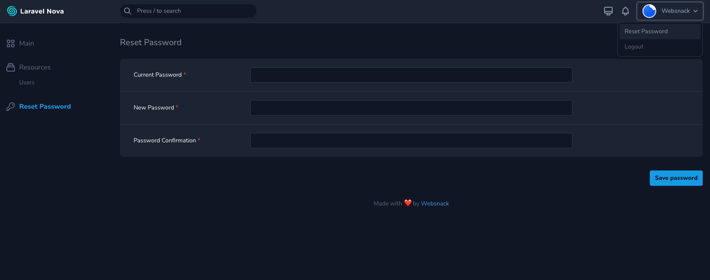

# Laravel Nova 4 - Reset Password

Easily reset your password from dashboard on Nova 4.


## Screenshot



## Requirements

* PHP ~8.0
* [Laravel](https://laravel.com) 
* [Laravel Nova 4](https://nova.laravel.com)

### Installation

Install package via composer:
```bash
composer require websnack/password-reset
```

Register tool in `tools` method of the `NovaServiceProvider`:
```php

// in app/Providers/NovaServiceProvider.php
 
public function tools()
{
    return [
    
        // ...
        
        (new \Websnack\ResetPassword\ResetPassword()),
        
    ];
}
```

### Usage

After installation, you can find the tool in the sidebar of admin panel dashboard.
if you have added a custom userMenu you have to manuel add the link to the tool like shown below.

```php

// in app/Providers/NovaServiceProvider.php

Nova::userMenu(static function (Request $request, Menu $menu) {
    return $menu
    
    // ...
        ->append(MenuItem::externalLink('Reset Password', '/reset-password'))
        
}),
```


### Configuration

Export config file to change position settings or minimum password length 

```
php artisan vendor:publish --tag="nova-reset-password-config"
```

Open and edit file `config/nova-password-reset.php`

```php
'min_password_length'   => 8

'show_on_sidebar'       => true,

'show_on_profile_menu'  => true,
```
___

## Contributor
* [Websnack](https://websnack.dk)
* [Websnack Github](https://github.com/websnack-dk)